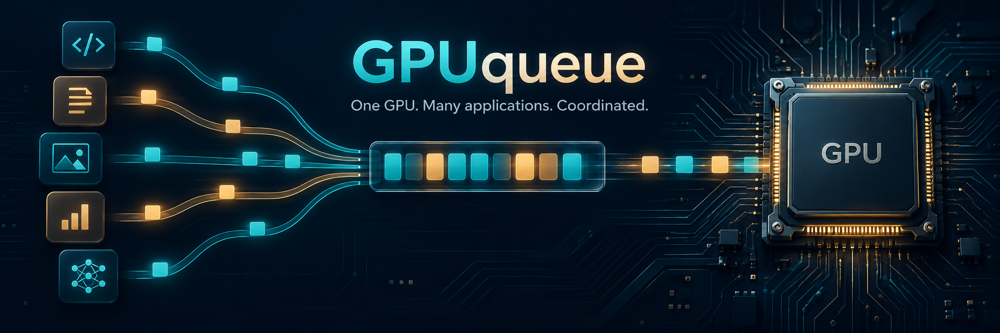
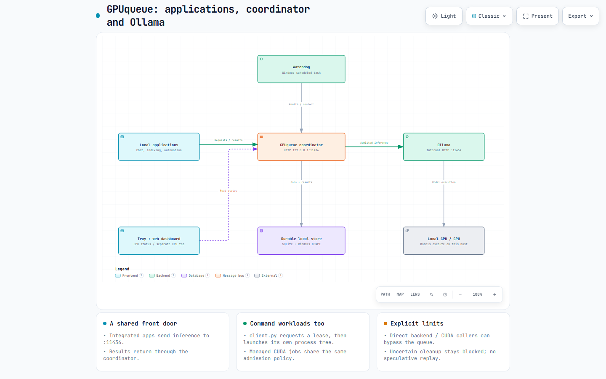

<p align="center"></p>

# GPUqueue

**A local coordination layer for applications sharing a resource-constrained Windows GPU.**

Chat, document indexing, image processing and a custom CUDA script can each work
well alone—and compete for the same VRAM when they run together. GPUqueue gives
integrated programs one place to request work, wait for capacity, explain why they
are waiting, and retrieve their results.

This is a **Windows-first reference implementation and development starting
point**, extracted from a working local setup. It combines an Ollama-compatible
HTTP front door with managed command jobs, durable state and a small desktop tray.
It is not an Ollama fork, a GPU driver, or a cluster scheduler.

[Explore the interactive architecture](https://kiragroh.github.io/GPUqueue/architecture.html)
· [Communication walkthrough](docs/communication.md)
· [Operations](docs/operations.md)
· [Related work](docs/related-work.md)
· [Roadmap](ROADMAP.md)

## What it does

| Capability | Current behavior |
|---|---|
| Shared inference entry point | Supported Ollama / OpenAI-style requests enter through `127.0.0.1:11436`; Ollama remains on `11434`. |
| Managed CUDA commands | A local client requests a lease, then launches and owns its process tree using a Windows Job Object. |
| Conservative admission | Priority aging, FIFO ties, fresh GPU measurements and declared VRAM budgets; unknown budgets run exclusively. |
| Durable requests | SQLite stores jobs, events and encrypted inputs/results. Async jobs receive an ID before inference. |
| Visible status | GPU-first tray status, CPU in a separate tab, CPU/GPU utilization, VRAM and a web history view. |
| Recovery | A watchdog restarts a missing coordinator. Ambiguous cleanup remains blocked for explicit reconciliation. |
| Per-user autostart | Optional installer registers the tray and watchdog with Windows Task Scheduler. |

**Limits are deliberate:** only integrated programs participate. Direct CUDA or
direct Ollama callers can bypass this coordinator. A declared budget is an
admission estimate, not a memory quota. No measured throughput or OOM-reduction
claim is made.

## Architecture



The [standalone Archify HTML](docs/architecture.html) includes light/dark themes,
zoom, component focus and export controls. Download it and open it locally, or use
the hosted link above. The editable specification is
[`docs/architecture.json`](docs/architecture.json).

The HTTP path is `application → coordinator → Ollama → coordinator → application`.
The command path is different: `client → lease → owned child process → release`.
The broker records command metadata; it does **not** execute submitted commands.
See the [step-by-step communication contract](docs/communication.md).

## Try the source

Requirements: Windows, Python 3.13, an NVIDIA GPU with `nvidia-smi` for GPU
admission, and a separately installed local Ollama for model requests. The tray
uses Windows Forms and the .NET Framework compiler supplied with Windows. Other
operating systems, AMD/Intel telemetry and multiple GPUs are not supported here.

```powershell
git clone https://github.com/Kiragroh/GPUqueue.git
cd GPUqueue
py -3.13 -m pip install -r requirements-dev.txt
py -3.13 -m pytest coordinator/tests tests -q
```

Tests use isolated state and synthetic backends; they do not invoke model
inference. The UI started as a German-language local tool: documentation and API
identifiers are English, while desktop/web labels currently remain German.
English UI localization is tracked in the roadmap.

For a manual first run on a host **without another coordinator on port 11436**:

```powershell
py -3.13 coordinator/server.py
```

Then open `http://127.0.0.1:11436/`. Pull models using Ollama's normal installation
workflow before submitting them. GPUqueue does not forward model-management
commands such as pulling or deleting models.

### Connect an application

Use `http://127.0.0.1:11436` as the Ollama base URL, or
`http://127.0.0.1:11436/v1` for the supported OpenAI-style routes. This is a subset
of the APIs, not a promise of compatibility with every client feature. Configure
timeouts for queue waiting, or use durable asynchronous submission.

```python
import requests

response = requests.post(
    "http://127.0.0.1:11436/api/generate",
    json={"model": "YOUR_INSTALLED_MODEL", "prompt": "Hello", "stream": False},
    timeout=(10, 900),
)
response.raise_for_status()
print(response.json())
```

The default route waits and returns the response. For a request that can be
looked up after a client disconnect, edit `examples/request.json` and submit:

```powershell
py -3.13 coordinator/client.py submit --owner demo --script examples/managed_worker.py --key demo-request-001 --json-file examples/request.json
py -3.13 coordinator/client.py job JOB_ID
py -3.13 coordinator/client.py result JOB_ID --output saved-result.json
```

`--script` should identify your **actual caller entry point** in real use; the
path above is an example. Reuse a logical idempotency key for the same request,
not for a different prompt. Retained results do not imply automatic replay.

### Coordinate your own GPU program

```powershell
py -3.13 coordinator/client.py run --owner image-worker --model my-model --script C:/work/infer.py --priority normal --vram-mb 6000 --min-free-mb 8000 -- C:/Python313/python.exe C:/work/infer.py
```

Use a measured, credible total peak budget. Omitting `--vram-mb` makes the job
exclusive. Import `guard.ensure_managed(...)` before CUDA initialization when you
want an entry-point guard; see [`examples/managed_worker.py`](examples/managed_worker.py).
For Windows virtual environments, read the [process identity caveat](docs/operations.md#process-identity-and-virtual-environments).

### Optional tray + watchdog installation

```powershell
$queuePython = py -3.13 -c "import sys; print(sys.executable)"
.\Install.ps1 -PythonPath $queuePython
```

This is an explicit, first-install helper. It copies the program to
`%LOCALAPPDATA%\Programs\GPUqueue`, stores runtime state separately under
`%LOCALAPPDATA%\GPUqueue\state`, and registers **GPUqueue Supervisor** and
**GPUqueue Tray** for your current Windows account. It refuses an existing
deployment. `-SupervisorOnly` omits the desktop build and tray.

No prebuilt executable is distributed. Build from reviewed source using
`Build.ps1`; the output is unsigned. If endpoint protection flags a build, stop
and follow your organization's normal review process—do not disable protection.

## Scheduling model

The prototype permits at most two budgeted GPU jobs, at most one Ollama GPU
request, and one verified CPU-embedding request. It reserves 2048 MiB in admission
calculations. Unknown budgets are exclusive. The policy deliberately subtracts
reservations conservatively even when allocated memory may already appear in the
GPU measurement. This can underutilize the GPU; it is not a throughput optimizer.

CPU routing is currently specific to a verified `openviking-embed:latest` alias
with Qwen3 embedding architecture and `num_gpu 0`. Other models use the GPU lane;
a model name alone is not a CPU guarantee. The alias is optional and is not
created by the installer. CPU cleanup compatibility still needs work.

## Trust and reliability boundaries

- Loopback, current Windows user, one local coordinator; do not expose it to a LAN.
- Inputs/results/context are DPAPI-encrypted. Metadata is not all encrypted;
  local status/history expose job metadata and optional case IDs without login.
- Same-user processes can read the control token. This is not tenant isolation.
- Tray status polls the backend; it does not keep the queue alive. The watchdog
  and Task Scheduler handle availability after user logon.
- Inference responses can arrive before cleanup finishes. A saved response is
  not proof that the model was released.
- Uncertain backend cleanup blocks that lane. It is never automatically cleared
  merely because the watchdog restarted the broker.
- No automatic history retention limit yet. Disk space, power loss, driver
  failures and unintegrated workloads remain operational concerns.

See [SECURITY.md](SECURITY.md) and [known limitations](ROADMAP.md). Contributions
should improve these boundaries without silently bypassing them.

## Why another queue?

[Ollama already schedules model requests](https://docs.ollama.com/faq#how-does-ollama-handle-concurrent-requests).
[GPU Task Spooler](https://github.com/justanhduc/task-spooler) and
[simple_gpu_scheduler](https://github.com/ExpectationMax/simple_gpu_scheduler)
cover command-oriented GPU work.
[ollama-queue-proxy](https://github.com/TadMSTR/ollama-queue-proxy) adds policy in
front of Ollama. GPUqueue explores the combination of a Windows desktop workflow,
durable inference results and owned command processes sharing one admission
policy. It is an independent example, not a claim that those projects lack
queuing or that this approach is universally better.

## Contributing

Start with [CONTRIBUTING.md](CONTRIBUTING.md). The [roadmap](ROADMAP.md) distinguishes
working mechanisms from planned improvements. Small, reproducible fixes and
integration examples are especially useful. Never include real prompts, tokens,
runtime databases or private paths in issues or pull requests.

Project-wide licensing is awaiting the owner's choice; see [LICENSING.md](LICENSING.md).
